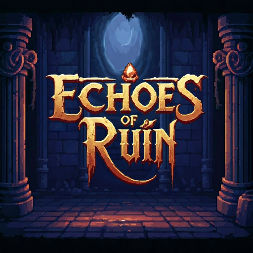

# Projet Echoes of Ruin


## Description  
__Echoes of Ruin__ est un jeu de type _Rogue_ dont l’objectif est d’aller le plus loin possible dans une suite de niveau générés aléatoirements. Si le joueur vient à mourir, il perd alors tous l'équipement qu'il portait sur lui et doit recommencer de zéro. Pour eviter cela, il peut déposer son équipement dans une planque afin de le récupérer plus tard.
Il a été développé dans le cadre des __Trophées de la NSI 2025__, notre problématique étant de concevoir un jeu basé sur un labyrinthe aléatoire.

## Installation  
1. Cloner le dépôt et l'extraire

2. Lancer l'exécutable main.exe directement depuis l'explorateur de fichier

__OU__

2. Ouvrir le dossier __"sources"__ dans un IDE Python _( VS Code est recommandé )_

3. Installer les dépendances avec la commande ```pip install -r ../requirements.txt```
_(il est recommandé d'utiliser un environnement virtuel)_

4. Dans le dossier __"sources"__ executer le fichier __"main.py"__

## Utilisation
- Pour lancer le projet :
    - Via un IDE Python, exécuter le fichier main.py
    - Ou exécuter le fichier main.exe
    
- Commandes :
    - __Z,Q,S,D__ pour bouger la camera
    - __Espace__ pour changer le mode de camera ( libre ou centrée )
    - __Up__ et __Down__ pour zoomer et dézoomer
    - __E__ pour ouvrire et fermer l'inventaire et sortir de la planque
    - __ECHAP__ pour revenir dans le niveau alors que vous marchez sur la sortie et êtes dans la planque
    - __Clic droit__ sur une case pour se déplacer
    - __Clic gauche__ sur un ennemi pour l'attaquer

- Une fois le bouton __Jouer__ appuyer, appuyer sur __E__ pour sortir de la panque et lancer le jeu
  (le chargement peut prendre du temps)

- Information d'utilisatin de l'éditeur de pièces :
    - Si quand vous appuyez sur __LOAD__ et que rien ne s'affiche, soit la pièce ne contient rien soit elle n'existe pas
    - Attention à ne pas écraser vos pièces déjà créées avec le bouton __SAVE__
    - Appuyez sur le bouton __EXIT__ pour retourner au menu principal

## Technologies utilisées
Python 3.14

## Auteurs
- Rhein Kilyan
- Magnaudeix Luc
- Corbeil Louis
- Godin William

## Licence
Ce projet est sous licence MIT - voir le fichier licence.txt pour plus d’informations.  

## À propos

Ce projet a été fait en 2025 en classe de terminale. J'ai apporté quelques modifications mineures entre-temps (corrections de bugs, amélioration de certains aspects...) mais le jeu reste globalement dans son état initial (il reste encore des bugs).
